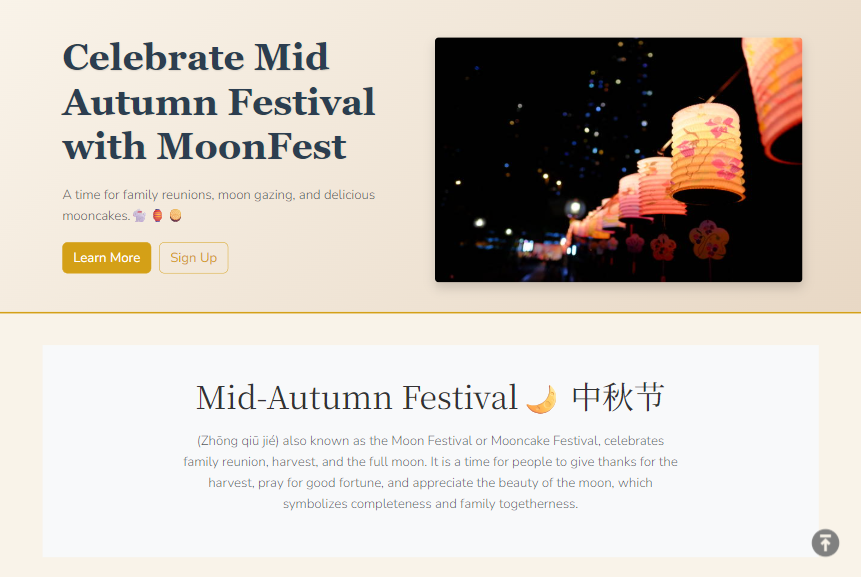
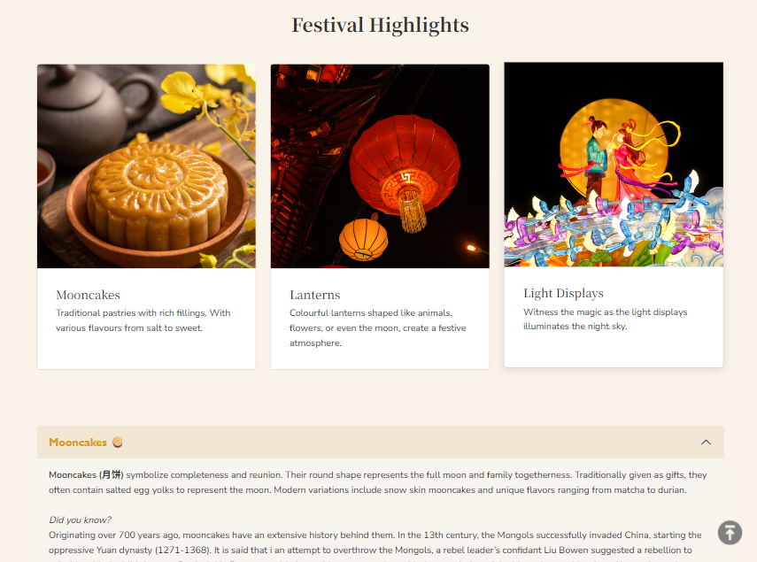
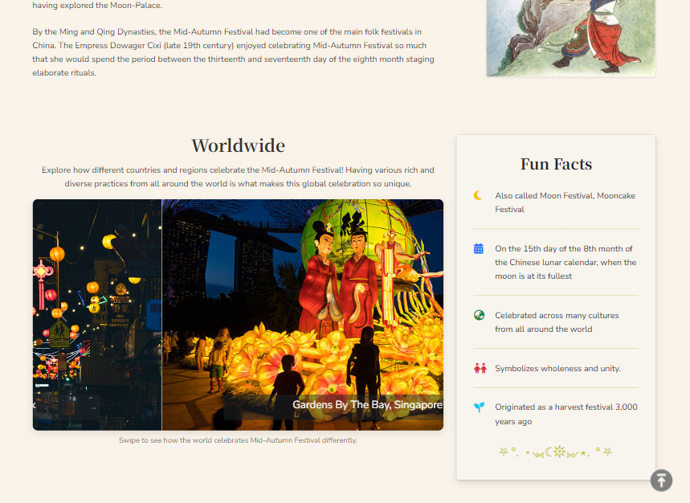
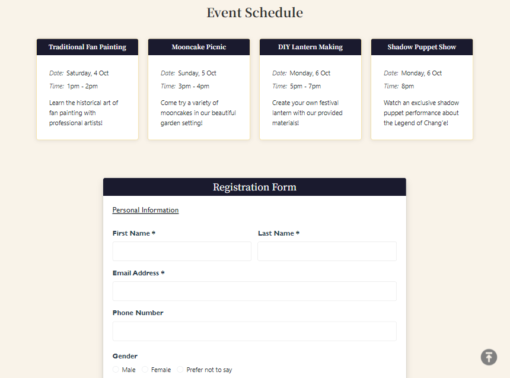

<div align="center">

# MoonFest 🌙

### A cozy, responsive website celebrating the Mid-Autumn Festival 中秋节

*Family reunions, moon gazing, lanterns & mooncakes — all in one place.* 🏮🥮🐇

<br>


[✨ Live Demo](https://your-username.github.io/your-repo-name/) · [🐛 Report a Bug](../../issues) · [💡 Request a Feature](../../issues)

<br>



</div>

---

## 📖 Table of Contents

- [About](#-about)
- [Screenshots](#-screenshots)
- [Features](#-features)
- [Tech Stack](#-tech-stack)
- [Project Structure](#-project-structure)
- [Getting Started](#-getting-started)
- [Design Choices](#-design-choices)
- [Credits](#-credits)

---

## 🌙 About

**MoonFest** is a multi-page website that introduces the history, culture and traditions of the Mid-Autumn Festival, and lets visitors register for a (fictional) 2025 community celebration.

It was built from scratch with **vanilla JavaScript** and **Bootstrap 5** — no frameworks, no build tools — with a focus on clean structure, accessibility-minded markup, and a warm, festive visual identity.

| Page | What's inside |
| :--- | :--- |
| 🏠 **Home** | Hero banner, festival highlights, interactive accordion, call-to-action |
| 📜 **About** | History timeline, worldwide celebrations carousel, fun facts, the Legend of Chang'e (with video) |
| 📝 **Register** | Event schedule cards, full registration form with validation, terms & conditions modal |

---

## 📸 Screenshots

<div align="center">

| Home | About |
| :---: | :---: |
|  |  |

| Register | Dark Mode 🌑 |
| :---: | :---: |
|  |  |

</div>

---

## ✨ Features

### 🎨 Design & UX
- 🌗 **Light / Dark theme toggle** — remembered between visits via `localStorage`
- 📱 **Fully responsive** layout, from phones to widescreens
- 🖼️ **Image zoom & hover effects** on highlight cards
- 🎠 **Autoplay carousel** showcasing celebrations around the world (Montréal, New York, Singapore, Shanghai)
- 🪗 **Accordion sections** for mooncakes, lanterns and light displays
- ⬆️ **Back-to-top button** for easy navigation

### ⚙️ Functionality
- 🗓️ **Dynamic event cards** — rendered from a JavaScript data array, so adding an event is a one-object change
- ✅ **Custom form validation** with inline error messages (required fields, email format, day selection, terms agreement)
- ⏳ **Simulated submission flow** — loading spinner → success message → automatic form reset
- 🔢 **Live character counters** on the dietary & comments text areas
- 📄 **Terms & Conditions modal** built with Bootstrap
- 🎊 **Confetti burst** when you click a festival highlight card

---

## 🛠️ Tech Stack

| Category | Tools |
| :--- | :--- |
| **Markup** | HTML5 (semantic elements) |
| **Styling** | CSS3, Bootstrap 5.3 |
| **Scripting** | Vanilla JavaScript (ES6) |
| **Icons** | Font Awesome 6.4 |
| **Fonts** | Noto Serif SC, Nunito Sans, Cormorant Garamond (Google Fonts) |
| **Storage** | `localStorage` (theme preference) |

---

## 📂 Project Structure

```
moonfest/
├── index.html        # Home page
├── info.html         # About / history / legend page
├── form.html         # Event schedule + registration form
├── styles.css        # Custom styles + dark mode theme
├── scripts.js        # Theme toggle, events, validation, confetti
├── images/           # Site imagery & icons
└── docs/
    └── screenshots/  # README screenshots
```

---

## 🚀 Getting Started

No installation needed — it's a static site!

```bash
# 1. Clone the repository
git clone https://github.com/your-username/your-repo-name.git

# 2. Move into the project folder
cd your-repo-name

# 3. Open it in your browser
open index.html          # macOS
start index.html         # Windows
xdg-open index.html      # Linux
```

💡 **Tip:** for live reloading, use the [Live Server](https://marketplace.visualstudio.com/items?itemName=ritwickdey.LiveServer) extension in VS Code.

---

## 🎨 Design Choices

<div align="center">

| Colour | Hex | Used for |
| :---: | :---: | :--- |
|  | `#1a1a2e` | Midnight navy — navbar, footer, CTA |
|  | `#d4a017` | Lantern gold — buttons & accents |
|  | `#f8d56b` | Moonlight yellow — hovers & highlights |
|  | `#f9f3e9` | Warm parchment — page background |

</div>

The palette is inspired by the festival itself: deep night skies, glowing lanterns and pale moonlight. Typography pairs a traditional serif (**Noto Serif SC**) for headings with a clean sans-serif (**Nunito Sans**) for body text.

---

## 🙏 Credits

- **Images:** [Unsplash](https://unsplash.com), [iStock](https://www.istockphoto.com), [Getty Images](https://www.gettyimages.com), [Visit Singapore](https://www.visitsingapore.com), and Wikimedia Commons (E.T.C. Werner, *Myths & Legends of China*, 1922 — public domain)
- **Icons:** [Font Awesome](https://fontawesome.com) & [Kreasi Kanvas](https://www.iconfinder.com/kreasikanvas) (back-to-top icon)
- **Framework:** [Bootstrap](https://getbootstrap.com)
- **Badges:** [Shields.io](https://shields.io)

> Images are used for educational / non-commercial purposes. All rights belong to their respective owners.

---

<div align="center">

### 🌕 Happy Mid-Autumn Festival! 🌕

Made with 🥮 and a lot of ☕


<br>


</div>
